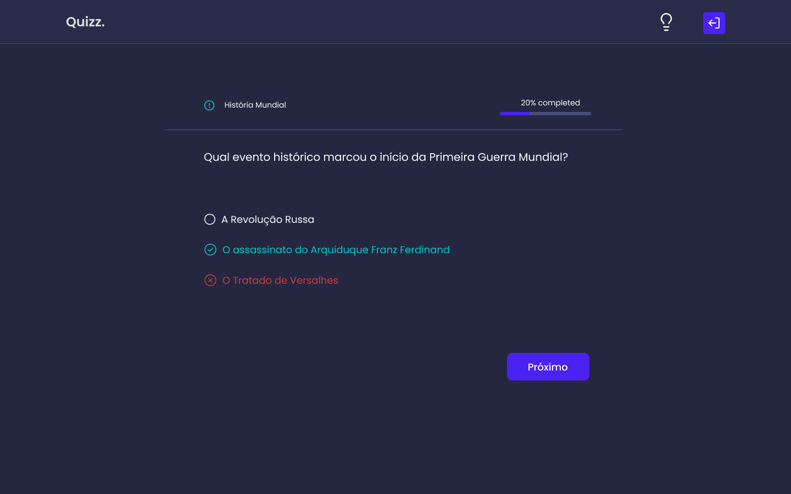

# Quiz trivia app

Este é um emocionante quiz trivia desenvolvido em React e TypeScript. Teste seus conhecimentos em uma variedade de tópicos enquanto se diverte respondendo perguntas. O projeto oferece uma experiência interativa e fácil de usar.

## Tecnologias Utilizadas
- [Tailwind](https://tailwindcss.com) - Para Estilização
- [React](https://reactjs.org/) - Biblioteca JS
- [TypeScript](https://www.typescriptlang.org) - Superset de JavaScript que traz tipagem estática para o projeto.
- [Vite](https://vitejs.dev) - Ferramenta de Desenvolvimento

#

[Live Site](https://brilliant-otter-3bb675.netlify.app/)
